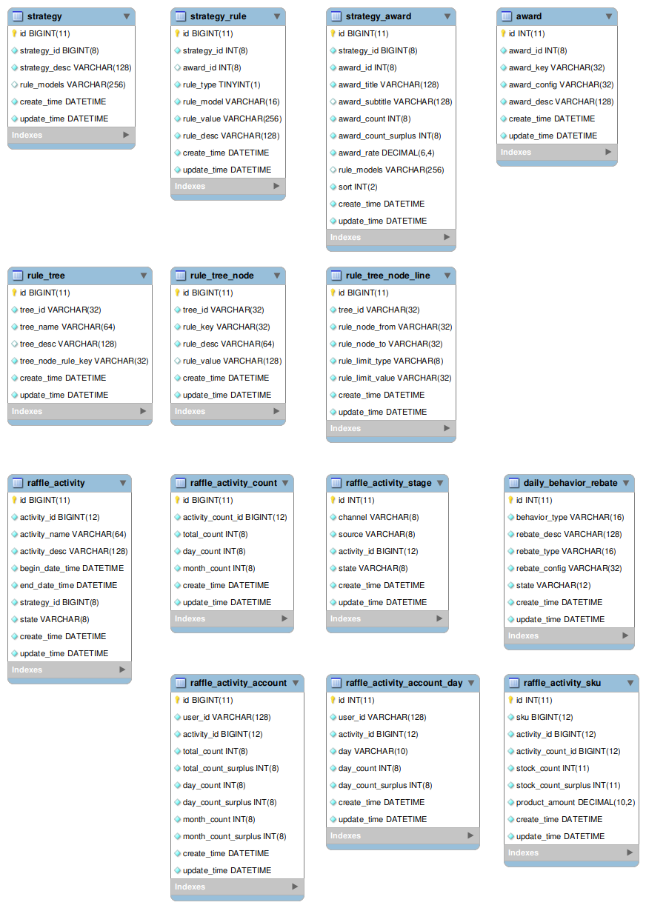

# 抽奖系统方案设计

+ **数据结构**

  最重要的是数据结构的设计。

  

  **抽奖与奖品规则**：

  其中 `strategy + strategy_rule` 配置了抽奖概率算法和额外抽奖规则（权重规则：消耗一定积分必中奖、黑名单规则：黑名单用户只奖励积分、不满足前两个条件才会执行概率抽奖）；`stategy_award + rule_tree + rule_tree_node + rule_tree_node_line + 一些用户参与计数表` 配置了每一种奖品的规则（比如：库存扣减规则[实物类商品]、兜底奖励[比如积分奖品]、次数锁规则[某些奖品需要达到一定的参与次数才能解锁]）。

  rule_tree 定义了一些商品规则树(rule_tree.tree_node_rule_key是根规则节点)，rule_tree_node_line 记录从根规则节点开始的每一条规则链，即每个奖品可以有多个规则，且规则有顺序。

  **活动规则**：

  + 活动时间、活动状态

    活动有效 = open状态 + 在活动期间内。 

  + 用户参与活动次数限制

  + 行为返利（签到行为返利、支付行为返利）

  + 积分兑换商品

    兑换条件

+ **抽奖策略**

  包括 **抽奖概率算法**、**额外规则**。

+ **抽奖概率算法**

  + **O1 算法**

    其实是为每个抽奖策略创建了一个查找表（这里使用Redis List 存储），以最小的概率值（0-1之间的BigDecimal）计算查找表的容量，全部商品总概率不需要一定为1，比如最小概率值是0.0001, 查找表容量最少需要10000, 然后按概率值占据查找表，表元素值为奖品ID。

    抽奖时通过 SecureRandom 生成一个随机数（比如生成0-10000之间的数）作为索引查找上面的查找表。

  + **OLogN 算法**

    如果存在奖品概率很小，上面算法会占很多空间，所以又实现了OLogN算法，使用 Map<Map<Integer, Integer>, Integer> 存储各种商品中奖区段（比如总共3种商品，A 0.5 B 0.3 C 0.2，Map 存储  (1->5)->Aid、(5->8)->Bid、(8->10)->Cid）；
    抽奖时同样先通过 SecureRandom 生成一个随机数然后查找 Map 获取中奖的商品；提供了3种查找算法，如果策略中奖品类型数量小于8直接使用 **for 循环遍历**查找、如果类型数量位于8-16之间使用**二分查找** 先将map排序缓存然后从中间开始查找，如果类型数量大于16使用**多线程并发匹配查找**。

  上面过程概率不变，但是奖品有库存，某个奖品抽完了怎么办？抽完了直接返回未中奖，或者返回“阳光普照奖”的 ID。

  概率抽奖其实也可以算作是一种规则。

+ **额外规则**

  如果某个策略额外配置了规则，会额外生成抽奖算法实例，但是算法不变，即额外规则不会影响算法的装配，实际影响的抽奖过程责任链处理，没有配置额外规则，责任链中只有一个默认的节点，每多一种规则会额外增加一个规则节点，默认节点作为最后的节点。

  默认节点用于执行抽奖算法。

  + **权重规则**

    比如抽奖消耗积分，当连续抽奖消耗积分达到某个阈值后，让用户在某个商品范围中必中奖。权重规则中实现了**权重抽奖算法**，

    默认是**非等值权重抽奖算法**，其实就是for遍历进行分值段匹配。经过权重规则处理如果抽中奖品立即返回。

  + **黑名单规则**

    通过黑名单可以为用户直接指定抽奖商品；当用户在黑名单中直接返回指定的商品。

+ **抽奖过程**

  1. 先校验抽奖策略ID是否有效；

  2. 执行抽奖请求的**责任链**处理：先借助工厂模式为每个抽奖策略装配一个责任链并缓存到应用本地Map；如果没有额外规则，就装配一个简单的默认责任链；如果有额外规则，则需要为每个规则创建一个责任链节点，最后将所有规则节点串联起来，最后加入默认的责任链作为最后一个节点；然后执行返回抽中奖品值对象；

  3. 如果第2步是通过概率算法计算中奖的奖品还需要执行**奖品规则树抽奖过滤**；

     规则树其实也类似**责任链模式**，rule_tree 中记录规则树要执行的第一个过滤规则，rule_tree_node 列举某个规则树下所有子规则，rule_tree_node_line 则定义各个子规则的执行顺序，以及当前规则执行结果对后续规则是否执行的条件。

     默认包含3种奖品规则：

     + **库存规则**

       通过Redis decr 减库存。

     + **兜底奖励规则**

       可以在库存扣减失败后，执行兜底奖励规则，奖励一些积分等。

     + **次数锁规则**

       限制用户抽奖最大次数。

+ **库存扣减**

  借助 Redis 实现库存扣减。

  推荐使用 Lua 脚本实现库存余量判断和扣减，以及库存添加。

+ **设计模式**

  策略模式；

  工厂模式；

  责任链模式：这里使用链表实现责任链。